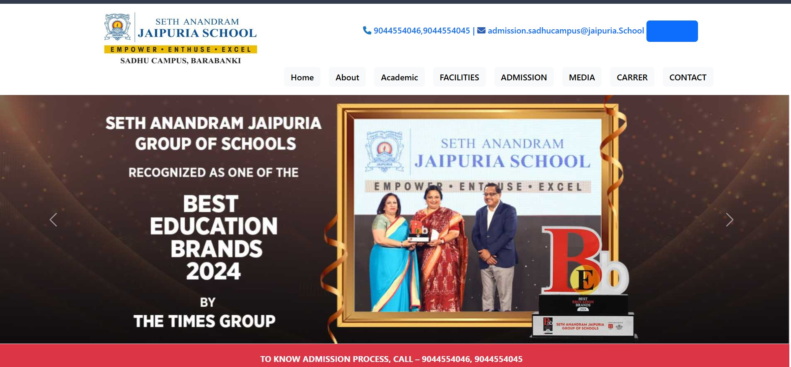
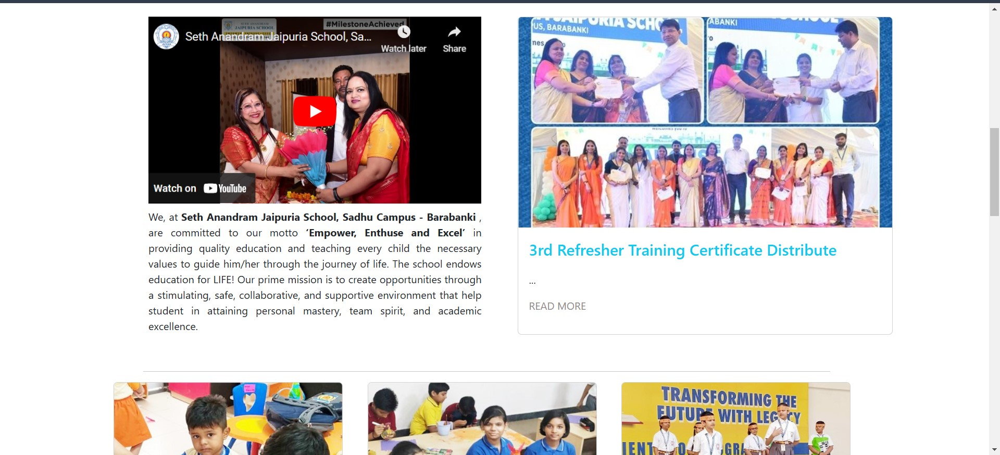
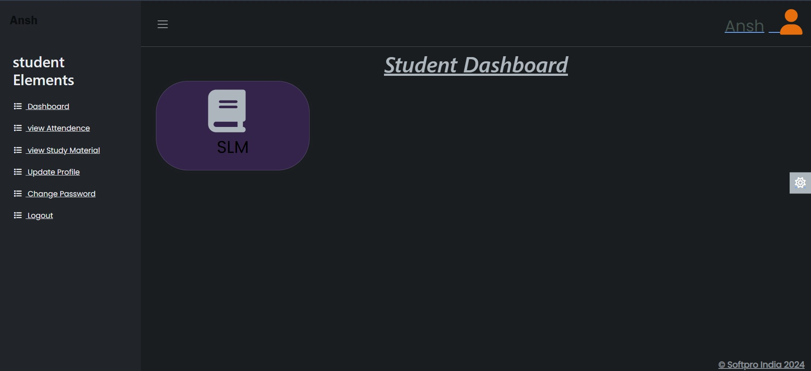
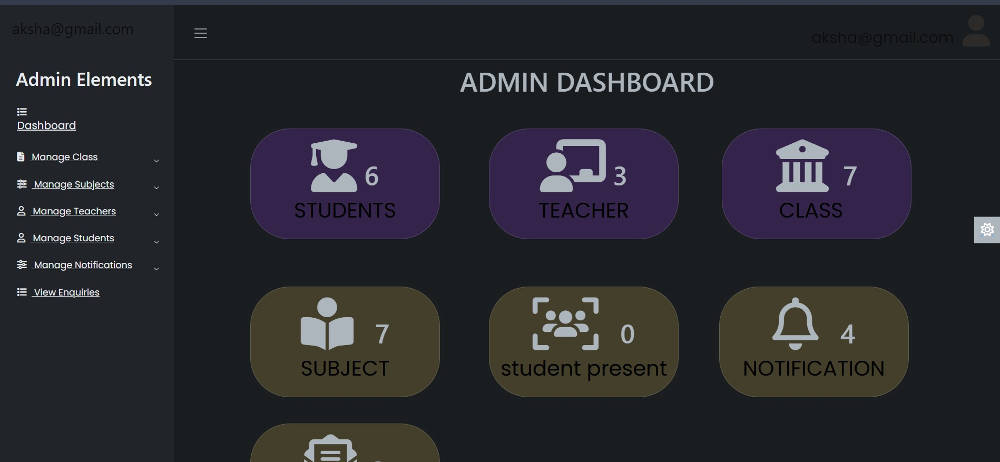
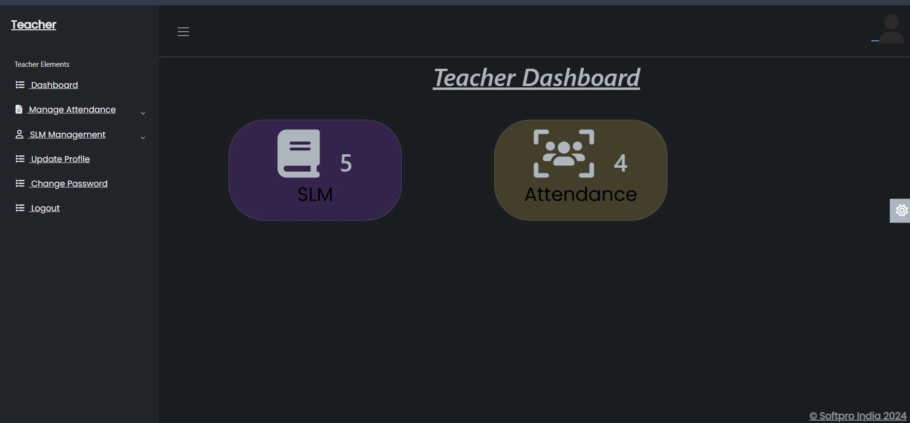
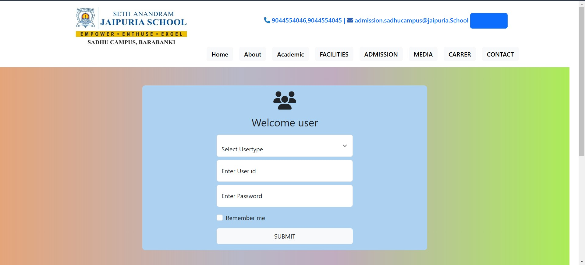
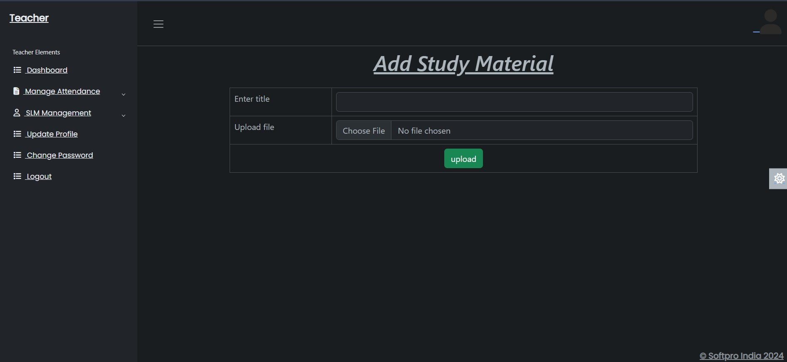
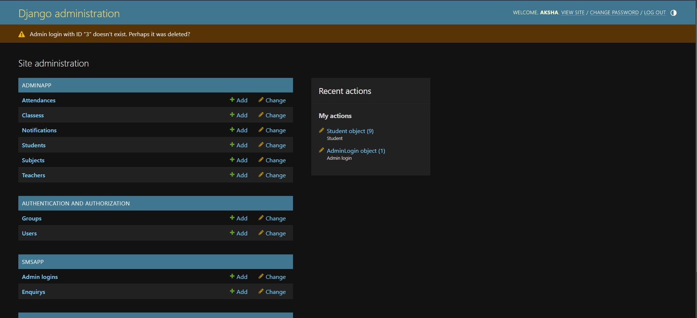

# Student Management System
The School Management System (SMS) is a comprehensive web-based application developed using modern technologies such as Django, React, HTML, CSS, and JavaScript. It aims to digitize and streamline various aspects of school administration, from managing student information to enabling seamless communication between teachers, students, and administrators.

## Features
Student Information System: A detailed student database with fields like roll number, name, program, branch, and year. This system enables tracking and managing student records efficiently.

Login Management System: Validates user logins and differentiates between admin, teacher, and student roles. It offers a secure environment for role-based access.

Discussion Forum Management: A platform for students to ask and answer questions, promoting collaborative learning. This module fosters interaction and doubt resolution.

Complaint Management System: A dedicated system where students can raise complaints, and administrators can track, manage, and resolve them.

Feedback Management System: Allows students to provide feedback, which is visible to the administrators. This promotes transparency and improvement.

News Management: Administrators can post important news and announcements, which are displayed on the school’s notice board for all users to view.

Enquiry Management: Facilitates the submission of inquiries by users, which are visible to the admin panel for review and response.

Study Material Management: Teachers can upload study materials for students based on their course and subject. These materials are easily accessible to students through the system.

Email Integration: When a student registers, the system sends an automated email confirming their registration. This ensures prompt communication.

SMS API Integration: System-generated SMS notifications are sent to users who submit inquiries, providing instant feedback.

## Technologies Used
Backend: Python with Django Framework
Frontend: ReactJS, HTML, CSS, JavaScript
Database: SQLite3

Styling: Bootstrap and CSS for responsive and user-friendly design

## Project Structure and Development
Software Development Model: The project follows the Software Development Life Cycle (SDLC) model, incorporating:

Requirement Analysis
System Design (UI/UX and Backend)
Coding and Development
Testing
Implementation
Maintenance
Design:

UI/UX: A user-friendly interface with clean, responsive design for Students, Teachers, and Admins.
Backend: Django for server-side logic, efficient database management, and secure login authentication.
Coding:

Written in Python and JavaScript, focusing on creating modular, reusable code to handle different school operations.
Testing:

Extensive testing of each module to ensure all functionalities, like login validation, data handling, and real-time updates, work smoothly.
Implementation:

Deployed on a secure web server, making it accessible to students, teachers, and administrators from any location.
Maintenance:

Continuous improvements and bug fixes are planned as part of the system’s lifecycle to keep up with the school’s evolving requirements.

## Contributing
Contributions to the School Management System are welcome. If you're interested in contributing, feel free to fork the repository and submit pull requests. Collaboration is encouraged to improve the system and expand its features.

## License
The School Management System is licensed under the MIT License, allowing others to freely modify and distribute the software.

## Acknowledgements
Special thanks to the development community and the administrative team at Seth Anandram Jaipuria School, Sadhu Campus for their insights and support in building this system.

Feel free to adapt the text further for your specific project, and ensure to replace any placeholders such as image links or licenses. This structure provides a detailed overview of the School Management System while maintaining clarity and accessibility for potential contributors and users.